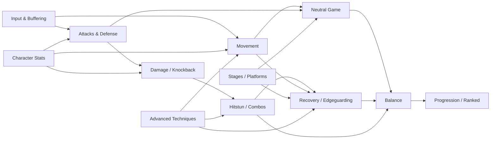
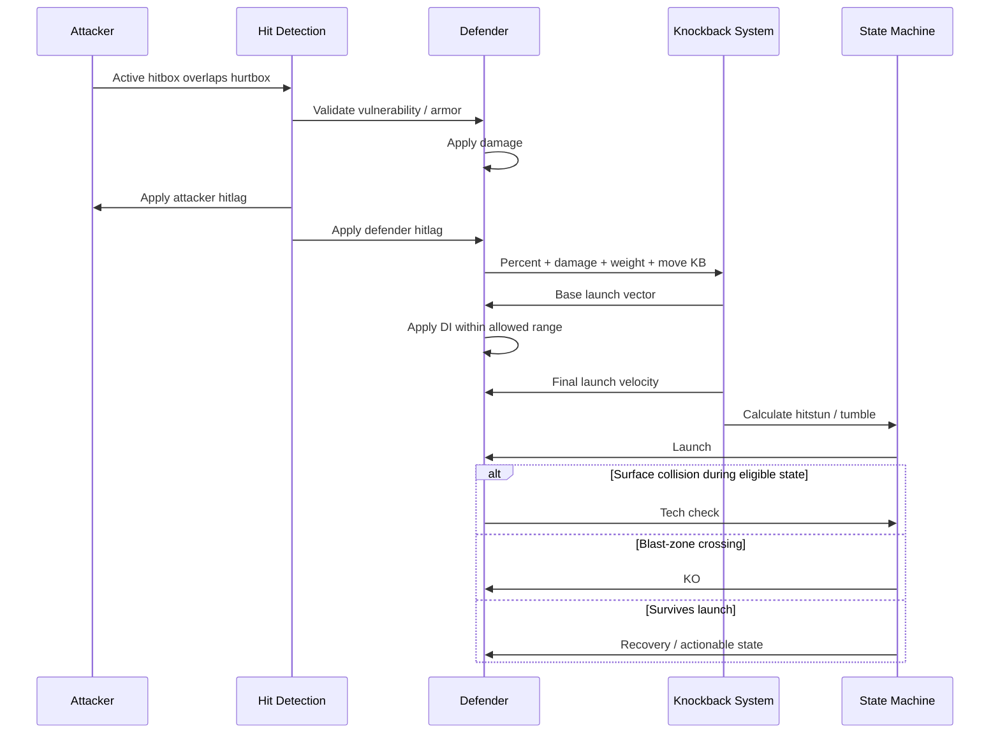

# Research-Backed Master Prompt for Claude: Designing a Complete Platform-Fighter Mechanics System

## Executive research synthesis

A high-quality prompt for this task should not merely tell Claude to “design a Smash-like fighting game.” It should force the model to make explicit, internally consistent choices across interacting subsystems: movement determines approach and recovery options; attack frame data determines neutral and punish windows; knockback and hitstun determine combos and survivability; shielding and grabs shape defensive equilibrium; stage geometry changes matchup dynamics; and input buffering changes the practical execution burden of every other mechanic.

That interaction is central to the genre. Nintendo's own description of *Super Smash Bros. Ultimate* reduces the core loop to attacking opponents, accumulating damage, launching them farther as their damage rises, and recovering after being launched from the stage. citeturn14view1 The official *Smash Bros. DOJO!!* further separates ordinary/strong attacks from more powerful smash attacks, identifies four directional special-move categories, describes grabs and directional throws as a counterpoint to shielding, and explicitly connects midair jumps and up-specials to recovery and anti-recovery play. citeturn14view2turn14view3turn14view4turn14view5

The prompt therefore needs to make Claude design a **system**, rather than a catalog of isolated mechanics.

A useful dependency model is:



Historical Smash mechanics demonstrate why the prompt needs quantitative treatment. Community reverse-engineering documents a knockback function in which post-hit percentage, move damage, target weight, knockback growth, base knockback, and additional multipliers interact rather than using a simple `damage = launch distance` mapping. citeturn15view0 Hitstun likewise scales with knockback; *Ultimate* retains a historical base relationship involving roughly `0.4 × knockback` before additional behavior such as its launch-speed treatment is considered. citeturn15view1 These are valuable prior-art references, but a new game does **not** need to reproduce Nintendo's exact equations. A better prompt asks Claude to compare a Smash-derived nonlinear model with simpler, designer-friendly alternatives and then choose one.

The same applies to advanced movement and execution mechanics. In *Melee*, wavedashing results from an air dodge angled into the ground, converting the air-dodge momentum into ground movement rather than being a separately recognized movement state. citeturn15view4 L-canceling uses a seven-frame pre-landing window and halves aerial landing lag in *Melee*, illustrating an especially strong execution-to-reward relationship. citeturn15view3 Directional influence lets a defender alter, but not completely replace, the original launch trajectory; *Melee* allows roughly an 18-degree maximum deviation under appropriate input geometry. citeturn16view1 These examples are particularly useful because they expose genuine design choices: whether advanced techniques should be accidental/emergent or intentional, whether execution should improve efficiency or unlock entirely new options, and how much defensive agency a player receives while being comboed.

The proposed master prompt below is deliberately structured with XML-style sections, explicit output requirements, assumptions, success criteria, and verification rules. That follows Anthropic's current guidance that Claude performs better with clear/direct requirements, explicit output constraints, context explaining the task, structured XML tags for complex prompts, and well-defined roles. Anthropic also recommends examples as a strong steering mechanism and notes that structured tags can reduce ambiguity when instructions, context, and inputs are mixed. citeturn14view0turn15view9

## Research-backed design anchors

The most useful prior art is not a single Smash ruleset, because the series itself demonstrates radically different answers to the same design problems. A strong Claude response should treat those differences as a design space rather than assuming that *Melee* or *Ultimate* represents the uniquely correct solution.

### Combat, frame data, and defensive systems

Frame data should use a precise common vocabulary. Competitive Smash documentation describes startup as the delay before a move first becomes effective, active frames as the period in which the attack can connect, ending/recovery lag as the period before the attacker may act again, and landing lag as the aerial-specific recovery incurred on landing. Frame data is conventionally discussed at 60 frames per second in Smash, making one frame approximately 16.67 ms. citeturn15view7 For an engine-independent specification, the best approach is to retain **design frames** at a 60 Hz reference while always giving milliseconds alongside them.

Shields are especially important because their tuning determines whether offense is risky or oppressive. In Smash, shields block most normal attacks but not grabs or designated unblockables; they deplete while held and when struck, regenerate while inactive, and can break when exhausted. Shieldstun is tied substantially to the blocked attack's damage. citeturn17view0 This creates several independent knobs that Claude should expose: maximum shield health, passive drain, hit damage to shield, regeneration delay/rate, shieldstun, attacker pushback, defender pushback, shield-drop lag, parry timing, and shield-break punishment.

Nintendo's own balance patches demonstrate that these parameters really are independently tunable design levers. Official *Ultimate* fighter adjustments have changed such things as shield size, attack power, launch distance, attack speed, vulnerability windows, hit-detection duration and grab reliability rather than treating a character's “power” as one scalar. citeturn15view8 The generated design should therefore be data-driven enough that these properties can be tuned separately.

### Recovery, ledges, and advanced defensive agency

Recovery should be specified as a resource-and-state system, not merely “characters have an up-special.” Nintendo's own documentation explicitly presents midair jumps followed by an up-special as a recovery sequence and immediately connects that sequence to anti-recovery aerial play. citeturn14view5 Ledges add another state machine: community documentation records climb, ledge attack, roll, jump and drop options, as well as evolving rules about regrabs and intangibility. *Ultimate*, for example, removes repeated ledge-grab intangibility and places a cap on successive grabs before the character must touch the ground or take hitstun. citeturn15view5

Edgeguarding is consequently an emergent interaction among recovery distance, aerial mobility, ledge rules, blast-zone placement, meteor attacks, stage geometry and the edgeguarder's own risk of dying. Competitive documentation distinguishes going offstage to intercept a recovery from remaining onstage to cover the opponent's return. citeturn15view6 A good design specification should therefore quantify **recovery-route diversity** and **edgeguard risk/reward**, not just recovery distance.

Teching provides another important defensive escape valve. Across Smash titles its input window and restrictions have changed significantly, showing that even a mechanic with the same name can create different levels of execution difficulty and defensive reliability. citeturn15view2 Claude should be asked to decide whether teching is predictive, reactive, buffered, mash-resistant, subject to a lockout, and available against all knockback strengths.

### Stages, progression, and competitive structure

Stages need two parallel design philosophies: expressive casual stages and controlled competitive geometry. Nintendo explicitly markets dynamic stages with shape changes and guest-character hazards, along with Stage Morph and stage creation. citeturn17view1 *Ultimate* also permits stage hazards to be disabled, demonstrating the usefulness of separating a stage's core geometry from optional dynamic elements. citeturn16view2 A new platform fighter can make that division even more systematic by defining tournament geometry presets and independent hazard layers.

Progression should similarly separate **competitive power** from **extrinsic progression**. Smash provides one example of a broad collectible/progression layer through Spirits, including collectible bonuses, leveling, training and special battle conditions. citeturn16view4 Its online system separately uses Global Smash Power and an Elite Smash threshold for skill-oriented matchmaking. citeturn16view5 Brawlhalla provides another useful platform-fighter precedent: its official ranked seasons use Elo-based ratings, placement matches, soft seasonal resets and cosmetic ranked rewards. citeturn18search9turn18search16 For a more uncertainty-aware rating design, Mark Glickman's primary documentation identifies Glicko-2 as an improvement on Glicko and states that both systems are in the public domain. citeturn14view15

A strong specification should explicitly decide whether competitive fighters/moves are available immediately, whether unlocks affect only cosmetics or casual modes, how hidden matchmaking rating relates to visible ranks, and how placement, inactivity and seasonal resets work.

### Recommended starting calibration envelope

The following numbers are **design hypotheses, not claims about Smash values**. Their purpose is to keep Claude from producing disconnected numbers. The prompt tells Claude to analyze and revise them where necessary.

Use an engine-independent spatial convention such as **1 SU = the standing height of the baseline all-rounder** and a documentation convention of **1 design frame = 1/60 second**.

| System | Suggested exploration range | Baseline example | Design question |
|---|---:|---:|---|
| Walk speed | 2.0–4.0 SU/s | 3.0 | How useful is precise ground spacing? |
| Run speed | 4.5–8.0 SU/s | 6.0 | How quickly can neutral space collapse? |
| Ground acceleration | 18–45 SU/s² | 30 | How responsive is reversal/microspacing? |
| Full-hop apex | 1.8–3.2 SU | 2.4 | How easily are platforms cleared? |
| Jump squat | 3–6f | 4f | Responsiveness versus commitment |
| Short-hop height | 45–65% full hop | 55% | Aerial pressure height |
| Double-jump strength | 70–120% first jump | 90% | Recovery/combo escape flexibility |
| Fast-fall multiplier | 1.25–1.65× | 1.45× | Aerial timing variability |
| Air-dash duration | 12–24f | 18f | Mobility versus commitment |
| Air-dash travel | 0.8–2.0 SU | 1.3 SU | Recovery and aerial burst |
| Wavedash travel | 0.6–2.2 SU | 1.2 SU | Ground mix-up reward |
| Light attack damage | 2–7% | 5% | Combo versus damage role |
| Tilt damage | 5–11% | 8% | Low-risk neutral reward |
| Smash damage | 12–24% | 17% | Commitment versus KO reward |
| Aerial damage | 5–15% | 9% | Air-to-air / pressure efficiency |
| Throw damage | 4–12% | 7% | Grab reward before follow-up |
| Typical fast startup | 3–7f | 5f | Fastest punish/check options |
| Typical tilt startup | 5–11f | 7f | Neutral attack speed |
| Smash startup | 10–26f | 16f | Telegraphing of finishers |
| Aerial startup | 4–14f | 7f | Aerial responsiveness |
| General landing lag | 4–20f | 10f | Air attack commitment |
| Character weight index | 75–125 | 100 | Survivability spread |
| Base knockback | 10–70 units | 30 | Low-percent displacement |
| Knockback growth | 40–130 | 90 | Scaling toward KO ranges |
| Hitstun coefficient | 0.30–0.45 × KB | 0.38 | Combo windows |
| Shield health | 40–70 points | 55 | Pressure duration |
| Shield passive drain | 0.08–0.20/frame | 0.12 | Holding-defense cost |
| Shield regeneration | 0.05–0.14/frame | 0.09 | Reset time |
| Parry/perfect-block window | 3–6f | 4f | Precision requirement |
| Shield-break stun | 90–180f | 120f | Reward for shield pressure |
| DI maximum angle | 10–18° | 14° | Defender agency |
| Tech window | 6–12f | 9f | Reaction/execution burden |
| Tech-input lockout | 20–40f | 30f | Mash prevention |
| L-cancel window | 5–8f | 6f | Execution difficulty |
| L-cancel lag multiplier | 0.50–0.75× | 0.65× | Reward magnitude |
| General input buffer | 3–10f | 6f | Responsiveness versus accidental inputs |
| Initial ledge intangibility | 20–45f | 30f | Recovery safety |
| Regrab intangibility | 0–15f | 0f | Anti-stalling |
| Typical legal stage width | 16–28 SU | 22 SU | Neutral-space scale |
| Side blast-zone margin | 7–14 SU | 10 SU | Horizontal survivability |
| Hazard warning | 30–120f | 60f | Reactability |
| Ranked placements | 5–10 matches | 8 | Rating initialization |

These should be treated as a **joint calibration space**. For example, increasing run speed while leaving stages small and attack recovery short can compress neutral excessively; increasing DI while reducing hitstun can remove intended combos; improving recoveries while increasing ledge invulnerability can weaken edgeguarding twice over. The prompt below forces Claude to identify those dependencies.

## Copy-paste master prompt for Claude

```text
<role>
You are a principal combat designer, systems designer, competitive-game balance designer,
technical game designer, and gameplay-research analyst specializing in platform fighters.

Your task is to produce a complete, implementation-oriented GAME MECHANICS DESIGN
SPECIFICATION for an original platform fighting game inspired by the systemic depth of
games such as the Super Smash Bros. series and other platform fighters, without copying
proprietary characters, audiovisual content, stage designs, move animations, fictional
settings, or other expressive content.

Think like a lead designer preparing a mechanics specification that will be handed to:
- gameplay programmers,
- character designers,
- level designers,
- QA/test engineers,
- competitive-balance designers,
- UX/input designers,
- online/ranked-system designers.

The specification must be rigorous enough that a prototype team could implement the
mechanical rules without having to guess what the major systems mean.
</role>

<context>
The game is an original "percentage/damage accumulation + knockback + blast-zone"
platform fighter in the broad mechanical tradition established by Super Smash Bros.

No specific engine, programming language, rendering technology, hardware platform,
controller, networking model, or business model has been selected.

Therefore:
1. Keep mechanics engine-independent.
2. Express algorithms as pseudocode and equations rather than engine-specific code.
3. Where timing is expressed in frames, use a DESIGN REFERENCE of 60 Hz:
   1 design frame = 1/60 second ≈ 16.67 ms.
4. Also give important timing values in milliseconds so the design can later be adapted
   to another simulation frequency.
5. Define a normalized spatial unit:
   1 SU = the standing hurtbox height of the baseline all-rounder character.
6. Express movement speeds primarily in SU/second and accelerations in SU/second².
7. Use percentage damage ("0%, 50%, 100%" etc.) as the default accumulated-damage
   notation, but make the underlying implementation independent of UI formatting.
8. Assume the game should work for both approachable casual play and serious
   competitive 1v1 play.
9. Competitive depth should emerge from decision-making, spacing, movement,
   matchup knowledge, timing, adaptation, and controlled execution—not merely from
   obscure inputs.
10. Where accessibility and high-level technical expression conflict, explicitly analyze
    the trade-off instead of silently favoring one.
</context>

<design_thesis>
Design an original platform fighter with these high-level goals:

- Immediately understandable core objective:
  damage opponents, increase their knockback vulnerability, and launch them beyond
  stage blast zones while avoiding the same fate.
- Low input-floor but high decision-making ceiling.
- Responsive movement with deliberate momentum.
- Strong ground/air interplay.
- Distinct advantage, disadvantage, neutral, recovery, ledge, and offstage states.
- Multiple viable character archetypes.
- Meaningful defensive counterplay without making defense dominant.
- Recoveries strong enough to create interesting offstage interactions, but not so safe
  that edgeguarding becomes irrelevant.
- Advanced techniques that create optimization and expressive choices without making
  beginners feel that the basic controls are nonfunctional.
- Frame data that is internally consistent and numerically testable.
- Mechanics designed to support balance patches through tunable parameters.
- Casual stage/hazard variety that can coexist with a clean competitive ruleset.
- Competitive progression that rewards skill while avoiding gameplay-stat advantages
  in ranked play.
</design_thesis>

<critical_method>
Do NOT merely enumerate mechanics.

For EVERY major subsystem and every required mechanic below, provide:

A. Definition
   - What the mechanic is.
   - What player problem it solves.
   - What strategic role it serves.

B. Design goals
   - What behavior it should encourage.
   - What failure modes should be avoided.

C. Design alternatives
   - At least 2 meaningful implementation options when alternatives reasonably exist.
   - Prefer 3 options for major mechanics such as knockback, shield behavior, wavedash,
     DI, recovery, input buffering, L-canceling, and ranking.

D. Pros and cons
   - Competitive implications.
   - Accessibility implications.
   - Readability implications.
   - Balance implications.
   - Implementation complexity when relevant.

E. Recommended implementation
   - Pick one option as the baseline.
   - Explain WHY it best fits the overall design thesis.
   - Do not stay neutral when a concrete design decision is possible.

F. Numeric parameters
   For every tunable mechanic, provide:
   - parameter name,
   - unit,
   - plausible minimum,
   - recommended default,
   - plausible maximum,
   - sensitivity/risk if increased,
   - sensitivity/risk if decreased.

G. Formula/algorithm
   - Give pseudocode, equation, state machine, or timing algorithm as appropriate.
   - Define every variable.
   - State rounding/clamping rules.
   - State execution order where order affects results.

H. Interaction/dependency notes
   - Identify at least the most important mechanics that constrain this mechanic.
   - Example: hitstun depends on knockback, which depends on percent/weight/move data,
     and DI modifies the resulting trajectory.

I. Edge cases
   - Zero/maximum values.
   - Simultaneous events.
   - Platform/ledge interactions.
   - Multi-hit attacks.
   - Very light/heavy characters.
   - High accumulated damage.
   - Input collisions when relevant.

J. Tests and telemetry
   - At least one deterministic test.
   - At least one human/playtest question.
   - Relevant balance telemetry where measurable.

Never give a number without making clear what it means.
Never give a formula without defining its variables.
Never recommend a mechanic without discussing its effect on at least one neighboring
subsystem.
</critical_method>

<reference_calibration>
Use the following ONLY as an initial exploration envelope, not as immutable requirements.
These are proposed design-space starting points rather than claims about any particular
commercial game.

Movement:
- walk speed: 2.0–4.0 SU/s; candidate baseline 3.0
- run speed: 4.5–8.0 SU/s; candidate baseline 6.0
- ground acceleration: 18–45 SU/s²; candidate 30
- full-hop apex: 1.8–3.2 SU; candidate 2.4
- jump squat: 3–6 frames; candidate 4
- short-hop height: 45–65% of full hop; candidate 55%
- double-jump vertical contribution: 70–120% of first jump; candidate 90%
- fast-fall terminal-speed multiplier: 1.25–1.65x; candidate 1.45x
- air-dash total duration: 12–24f; candidate 18f
- air-dash distance: 0.8–2.0 SU; candidate 1.3 SU
- wavedash travel: 0.6–2.2 SU; candidate 1.2 SU

Combat:
- light attack damage: 2–7%; candidate 5%
- tilt damage: 5–11%; candidate 8%
- smash attack damage: 12–24%; candidate 17%
- aerial damage: 5–15%; candidate 9%
- throw damage: 4–12%; candidate 7%
- fastest normal startup: 3–7f; candidate 5f
- typical tilt startup: 5–11f; candidate 7f
- smash startup: 10–26f; candidate 16f
- aerial startup: 4–14f; candidate 7f
- aerial landing lag: 4–20f; candidate around 10f

Knockback and defense:
- character weight index: 75–125; baseline 100
- base knockback parameter: 10–70
- knockback-growth parameter: 40–130
- initial hitstun exploration: roughly 0.30–0.45 × final knockback magnitude
- shield health: 40–70; candidate 55
- passive shield drain: 0.08–0.20 points/frame
- shield regeneration: 0.05–0.14 points/frame
- perfect-block/parry window: 3–6f
- shield-break stun: 90–180f
- DI maximum trajectory adjustment: 10–18 degrees
- tech window: 6–12f
- tech-input lockout: 20–40f
- L-cancel timing window: 5–8f before landing
- L-cancel landing-lag multiplier: 0.50–0.75x

Input and ledges:
- general input buffer: 3–10f
- first ledge-grab intangibility: 20–45f
- repeated-grab intangibility: consider 0f as baseline
- repeated-ledge-grab limit or fatigue mechanic: explicitly design one

Stages:
- main competitive stage width: roughly 16–28 SU
- side blast-zone margin from stage: roughly 7–14 SU
- major hazard telegraph: roughly 30–120f

You MUST challenge these values.
If cross-system analysis indicates that a range or default is inappropriate, change it and
explain why.
</reference_calibration>

<required_mechanics>

<movement>
Design the complete movement model.

Cover:
- idle state
- turnaround
- walking
- initial dash
- running
- run turnaround
- dash/run braking
- crouching
- platform drop-through
- jumping
- short hop
- full hop
- jump squat
- double jump / midair jump
- aerial drift
- air acceleration
- gravity
- fall speed
- fast fall
- air dash
- directional air dodge if distinct from air dash
- landing
- hard landing
- wavedash
- waveland
- optional dash dancing or equivalent microspacing technique

For walking/running:
compare instant velocity, acceleration-based movement, and hybrid movement.

For jumping:
specify the equations or curves for:
- vertical launch velocity,
- gravity,
- apex time,
- jump height,
- fall speed,
- short-hop behavior,
- double-jump behavior.

For air-dash:
compare:
1. fixed directional impulse,
2. velocity override,
3. acceleration burst.

Specify:
- startup,
- invulnerability if any,
- active movement,
- recovery,
- momentum preservation,
- gravity suppression,
- use count before landing,
- whether it causes helpless state,
- landing recovery.

For wavedashing, explicitly compare:
1. emergent air-dodge-into-ground momentum conversion,
2. intentional supported movement mechanic,
3. a simplified dedicated ground slide.

Discuss:
- execution difficulty,
- spacing utility,
- platform movement,
- out-of-shield usefulness,
- whether attacks/grabs may be performed during the slide,
- traction dependence,
- character-specific wavedash lengths,
- beginner/advanced skill gap.

Provide a movement state-machine diagram in Mermaid.
</movement>

<attacks>
Design these attack classes:

- jab / neutral light
- rapid-jab or follow-up string if applicable
- forward tilt
- up tilt
- down tilt
- dash attack
- forward smash
- up smash
- down smash
- neutral aerial
- forward aerial
- back aerial
- up aerial
- down aerial
- neutral special
- side special
- up special
- down special
- grab
- pummel if used
- forward throw
- back throw
- up throw
- down throw

Define what differentiates:
- tilts,
- smashes,
- aerials,
- specials,
- grabs,
- throws.

For every attack class define expected ranges for:
- startup,
- active frames,
- recovery,
- total duration,
- damage,
- base knockback,
- knockback growth,
- launch angle,
- hitlag,
- hitstun modifier,
- shield damage modifier,
- shieldstun modifier,
- landing lag where relevant,
- cancel windows,
- armor/intangibility where relevant.

Explain the risk/reward identity of each attack category.

For smash attacks, specify:
- charging behavior,
- maximum charge time,
- damage scaling,
- knockback scaling,
- whether charge scaling is linear, piecewise, or curved.

For grabs:
define:
- startup,
- grab range,
- whiff recovery,
- successful-grab state,
- grab-release/escape rules,
- pummel behavior,
- throw-selection window,
- throw invulnerability if any,
- anti-chain-grab rules.

Explain the intended attack > shield > grab > attack-style interaction without assuming it
must be a perfectly symmetric rock-paper-scissors relationship.
</attacks>

<damage_and_knockback>
Design the accumulated-damage and launch model in detail.

First explain why percentage damage and knockback should be conceptually separate:
damage raises future vulnerability, while each attack independently supplies launch
properties.

Compare at least THREE knockback architectures:

A. Smash-inspired nonlinear knockback model incorporating:
   - target percent,
   - current attack damage,
   - target weight,
   - base knockback,
   - knockback growth,
   - global scalar.

B. Simpler affine/linear model suitable for easier balancing.

C. Curve-based or normalized model with designer-controlled survival targets.

For each:
- give formula,
- advantages,
- disadvantages,
- tuning behavior,
- ease of predicting KO thresholds,
- interaction with very light/heavy characters.

Then select a recommended model.

At minimum define:
P_before = target accumulated damage before hit
D = attack damage
P_after = damage after the hit
W = target weight
BKB = base knockback
KBG = knockback growth
A = launch angle
R = situational/mode multiplier
KB = resulting knockback magnitude

Include a damage algorithm such as:

P_after = clamp(
    P_before + D * damageMultipliers,
    0,
    P_MAX
)

and then propose the actual knockback equation.

Do NOT copy a historical commercial formula blindly.
Explain which features are retained and which are simplified.

Define:
- fixed knockback attacks,
- weight-independent attacks if supported,
- set-knockback combo tools,
- launch-speed conversion,
- horizontal/vertical velocity decomposition,
- knockback decay,
- gravity during launch,
- tumble threshold,
- blast-zone KO checking.

Provide equations such as:

vx = launchSpeed(KB) * cos(angle)
vy = launchSpeed(KB) * sin(angle)

and define coordinate/angle conventions.

Explicitly state operation order:

hit detection
→ damage
→ hitlag
→ knockback calculation
→ DI
→ velocity assignment
→ hitstun
→ launch/tumble
→ collision/tech checks
→ KO check.

Give worked numeric examples at approximately:
- 0%
- 50%
- 100%
- 150%

Use at least:
- one baseline all-rounder of weight 100,
- one lightweight,
- one heavyweight.

Calculate at least one approximate KO threshold.
</damage_and_knockback>

<hitlag_hitstun_and_landing>
Clearly distinguish:
- hitlag / freeze frames,
- hitstun,
- tumble,
- attack recovery,
- landing lag,
- hard landing,
- auto-cancel,
- actionable state.

Give proposed formulas for hitlag and hitstun.

Compare:
1. strictly knockback-proportional hitstun,
2. knockback-proportional hitstun with caps/curves,
3. move-specific hitstun modifiers.

Explain how each affects:
- true combos,
- strings,
- high-percent combos,
- defensive agency,
- perceived impact.

Define exactly when hitstun ends.

Define landing behavior for:
- landing normally,
- landing during an aerial attack,
- landing during hitstun,
- landing after air dodge,
- landing after air dash,
- landing after special moves,
- auto-cancel windows.

Give numeric landing-lag ranges by move category.

Create at least three example combo-window calculations:
attacker actionable frame versus defender actionable frame, including travel/reposition time.
</hitlag_hitstun_and_landing>

<shielding>
Design:
- shield activation
- shield hold
- shield health
- passive shield drain
- attack shield damage
- shield regeneration
- regeneration delay
- shieldstun
- shield pushback
- shield drop
- out-of-shield actions
- shield poking if used
- perfect shield / parry
- shield break
- post-break stun

Compare:
1. shrinking bubble shield,
2. fixed-volume shield with health only,
3. directional guard/parry-heavy defense.

Specify whether shield appears frame 1 after the game recognizes the input or has startup.

Propose formulas such as:

shieldDamage =
    attackDamage * shieldDamageMultiplier
    + bonusShieldDamage

shieldStunFrames =
    floor(
        attackDamage
        * shieldStunCoefficient
        * moveShieldStunMultiplier
        + constant
    )

shieldHP_next =
    max(0, shieldHP - shieldDamage)

Give formulas for:
- passive drain,
- regeneration,
- break condition.

Specify on-shield frame advantage:

attackerActionableFrame
versus
defenderActionableFrame

and explain how landing aerials alter the calculation.

Analyze grabs as a shield answer.

Define what a shield break rewards and how to prevent one shield break from automatically
becoming an excessive snowball.
</shielding>

<recovery_and_ledges>
Treat recovery as a complete subsystem.

Define recovery resources:
- remaining double jump,
- air dodge / air dash,
- special-move recovery,
- wall jump if present,
- tether if present,
- momentum,
- ledge availability.

Define:
- helpless/fall state,
- recovery-special rules,
- whether specials can be used more than once,
- resource refresh conditions.

For ledges define:
- grab detection volume,
- snap distance,
- facing requirements,
- maximum vertical/horizontal snap,
- ledge occupancy,
- first-grab intangibility,
- regrab intangibility,
- regrab limit/fatigue,
- ledge trump/steal behavior if any,
- ledge hang timeout,
- ledge drop,
- normal get-up,
- get-up attack,
- ledge roll,
- ledge jump,
- ledge release aerial options.

Compare:
1. exclusive ledge occupancy / ledge hogging,
2. ledge trumping,
3. shared or displaced ledge system.

Analyze edgeguarding explicitly.

Quantify:
- recovery distance,
- average number of recovery routes,
- low/high recovery mix,
- expected edgeguard risk,
- expected edgeguard reward,
- blast-zone proximity.

Design anti-stalling rules.

Use Mermaid to show the offstage/recovery/ledge state transition flow.
</recovery_and_ledges>

<stages_and_platforms>
Define stage coordinate conventions and blast zones.

Design:
- hard surfaces,
- walls,
- ceilings,
- soft/drop-through platforms,
- optional semisolid surfaces,
- moving platforms,
- slopes if supported,
- wall-jump surfaces,
- platform edges,
- blast zones.

For platforms specify:
- collision direction,
- drop-through input,
- drop-through buffer,
- platform landing behavior,
- aerial landing lag on platforms,
- tech interaction,
- wavelanding behavior.

Define competitive stage geometry guidelines:
- main-platform width,
- platform count,
- platform height,
- platform separation,
- side blast-zone distance,
- top blast-zone distance,
- bottom blast-zone distance,
- wall/ceiling restrictions.

Create at least four stage archetypes:
- flat/neutral,
- tri-platform,
- dual-platform,
- asymmetric or transforming casual stage.

Design a hazard taxonomy:
- damage hazards,
- knockback hazards,
- moving geometry,
- environmental enemies,
- temporary danger zones,
- stage transformations.

For every hazard specify:
- warning/telegraph time,
- active duration,
- damage/knockback,
- targeting logic,
- frequency,
- randomness,
- player counterplay.

Explain how to support:
- "hazards on" casual rules,
- "hazards off" competitive rules,
without requiring an entirely unrelated map.

Distinguish gameplay-readable randomness from outcomes that feel arbitrary.
</stages_and_platforms>

<character_archetypes_and_balance>
Create a normalized baseline fighter first.

Stats must include:
- weight
- walk speed
- run speed
- initial dash
- ground acceleration
- traction
- jump squat
- full-hop height
- short-hop height
- double-jump height
- gravity
- fall speed
- fast-fall speed
- air speed
- air acceleration
- air-dash properties
- shield size/health modifiers if character-specific
- grab range
- recovery rating

Then build AT LEAST FIVE complete example archetypes, preferably:

1. All-rounder / fundamentals character
2. Rushdown / pressure character
3. Heavyweight / bruiser
4. Zoner / space-control character
5. Aerial-mobility / floaty character

Optionally add:
- grappler,
- sword/disjoint specialist,
- trap/setup specialist,
- stance/resource character.

For each archetype provide:
- stat block,
- strengths,
- weaknesses,
- intended neutral plan,
- advantage state,
- disadvantage state,
- recovery profile,
- KO methods,
- combo profile,
- matchup vulnerabilities.

For each of the five required characters provide a move list covering:
- jab,
- forward/up/down tilt,
- dash attack,
- forward/up/down smash,
- neutral/forward/back/up/down aerial,
- neutral/side/up/down special,
- grab,
- forward/back/up/down throw.

The moves may use concise original placeholder concepts rather than elaborate fictional
lore.

Give representative damage, startup, active frames, total frames, launch angle, BKB/KBG,
landing lag, and intended role.

Do not make every archetype equal in every dimension.
Balance through asymmetric strengths plus exploitable weaknesses.

Create a "power budget" framework that distinguishes:
- mobility,
- frame speed,
- range/disjoints,
- damage,
- combo ability,
- KO power,
- weight/survivability,
- recovery,
- projectile/control strength,
- defensive tools.

Explain which combinations create multiplicative balance risk.
Example:
excellent speed + excellent frame data + excellent range is more dangerous than the sum
of three independent advantages.

Define target balance metrics without pretending that win rate alone proves balance.
</character_archetypes_and_balance>

<advanced_techniques>
Design and analyze:

- directional influence (DI)
- optional smash directional influence if appropriate
- teching
- wall teching
- optional tech rolls
- L-canceling or an original equivalent
- wavedashing
- wavelanding
- dash dancing if supported
- edgeguarding
- ledge trapping
- fast-fall aerial timing
- turnaround aerial / reverse aerial movement if supported

For DI:
give a vector/angle algorithm.

For example, explore a structure like:

relativeAngle =
    signedAngle(knockbackVector, stickVector)

diStrength =
    stickMagnitude
    * perpendicularity(relativeAngle)

angleDelta =
    maxDI
    * diStrength

finalLaunchAngle =
    baseLaunchAngle + angleDelta

But derive and recommend the exact function.

Define:
- maximum angle,
- analog dead zone,
- stick magnitude scaling,
- timing window,
- behavior near horizontal/vertical trajectories.

For teching:
define:
- eligible collision states,
- pre-impact input window,
- optional post-impact forgiveness,
- repeated-input lockout,
- neutral tech,
- tech roll,
- wall tech,
- ceiling tech if applicable,
- invulnerability,
- momentum retention,
- strong-hit exceptions if any.

For L-canceling compare:
1. no manual landing-lag reduction,
2. traditional timing-based lag reduction,
3. smaller timing reward,
4. automatic reduction earned through another decision such as precise fast-fall timing.

Explicitly address the "skill expression versus mandatory execution tax" problem.

If L-canceling exists, provide:
- input window,
- success feedback,
- lag multiplier,
- interaction with shields/air dodges,
- accessibility option philosophy,
- whether missing it should materially change combo routes.

For every advanced technique classify it as:
- intended core mechanic,
- intentionally advanced mechanic,
- tolerated emergent mechanic,
- undesirable exploit.

Explain WHY.
</advanced_techniques>

<input_system>
Specify input interpretation independent of any particular controller.

Define abstract actions:
- MoveX
- MoveY
- Jump
- Attack
- Special
- Shield
- Grab
- optional Dash/AirDash if needed.

Design:
- analog dead zones,
- tilt threshold,
- smash/flick threshold,
- flick timing,
- short-hop input,
- input priority,
- simultaneous-button chords,
- input buffer,
- hold buffer,
- input queue,
- repeated-input behavior,
- reversal windows,
- c-stick/right-stick style directional attack abstraction if supported.

Compare:
1. no/general minimal buffer,
2. fixed N-frame buffer,
3. action-specific buffer,
4. hold-buffer plus discrete input buffer.

Explain the effect of each on:
- responsiveness,
- accidental actions,
- online latency perception,
- advanced movement,
- reversals,
- recovery.

Specify a recommended general buffer window and exceptions.

Produce an input-resolution pseudocode algorithm defining what happens when several valid
actions are buffered simultaneously.

Give a priority table.

Do not silently use the same buffer rules for every state unless that is a deliberate
choice.
</input_system>

<frame_data_conventions>
Establish ONE unambiguous notation system.

Define:
- frame 1
- startup
- first active frame
- active-frame range
- recovery/endlag
- total animation duration
- first actionable frame (FAF)
- landing lag
- auto-cancel window
- hitlag
- hitstun
- shieldstun
- invulnerability
- intangibility
- armor
- cancel windows
- charge frames
- advantage on hit
- advantage on block/shield.

State whether an attack listed as:
Startup 7
Active 7–9
FAF 28

means:
- frames 1–6 startup,
- frames 7–9 active,
- frames 10–27 recovery,
- actionable on frame 28.

State whether frame intervals are inclusive.

State all rounding conventions:
- floor,
- ceil,
- round-half-up,
as applicable.

Give milliseconds alongside important frame timings.

Create sample frame-data tables for at least:
- one tilt,
- one smash,
- one aerial,
- one projectile special,
- one recovery special,
- one grab,
- one throw.

Include:
Move
Startup
Active
FAF
Recovery
Damage
Angle
BKB
KBG
Hitlag
Landing Lag
Shield Modifier
Cancel Notes
Special Properties.
</frame_data_conventions>

<progression_and_ranking>
Design progression WITHOUT forcing competitive players to unlock statistical power.

Compare progression approaches:
1. all gameplay-relevant characters immediately available,
2. characters unlocked through onboarding/play,
3. hybrid model where local/training/ranked availability differs,
4. cosmetic/mastery unlocks only.

Discuss the onboarding advantages and competitive disadvantages of locking fighters.

Design optional unlockables such as:
- cosmetics,
- alternate effects that do not affect readability,
- titles,
- badges,
- profile banners,
- emotes,
- stage cosmetics,
- music,
- mastery rewards,
- challenge rewards,
- training achievements.

Clearly separate cosmetic progression from mechanical progression.

For ranked matchmaking compare:
- Elo,
- Glicko-2,
- hidden MMR + visible rank tiers.

Discuss:
- uncertainty,
- placements,
- new accounts,
- inactivity,
- rank decay,
- seasonal soft resets,
- promotion/demotion,
- regional leaderboards,
- matchmaking range expansion,
- disconnects,
- rematches,
- smurfing,
- boosting,
- team modes.

Recommend one system.

Give pseudocode for matchmaking/rank update at an appropriate level of abstraction.

If choosing Glicko-2, do not invent its official mathematics from memory:
either reproduce it from a verified primary source or reference it as an external rating
module and specify the game-specific surrounding logic.

Provide example rank tiers and an example season lifecycle.

Explain which progression rewards may safely be tied to ranked success.
</progression_and_ranking>

</required_mechanics>

<formula_requirements>
At minimum the final document must contain executable-looking pseudocode or equations for:

1. accumulated damage update,
2. knockback magnitude,
3. weight scaling,
4. launch velocity decomposition,
5. knockback decay,
6. gravity during hitstun,
7. DI,
8. hitlag,
9. hitstun,
10. shield damage,
11. shield regeneration,
12. shieldstun,
13. shield break,
14. smash-attack charge scaling,
15. air-dash velocity/movement,
16. wavedash momentum conversion or dedicated wavedash model,
17. ledge eligibility,
18. ledge regrab/fatigue,
19. tech-input eligibility,
20. L-cancel timing/reduction if included,
21. input buffering,
22. hazard scheduling,
23. matchmaking/ranking wrapper logic.

For every formula:
- define all variables,
- state units,
- state valid range,
- state rounding,
- state clamping,
- give at least one numeric worked example when meaningful.
</formula_requirements>

<worked_calculations>
Include a dedicated calculation section.

At minimum calculate:

A. Damage + knockback:
- target at 0%
- target at 50%
- target at 100%
- target at 150%

B. Weight comparison:
apply the same attack to:
- lightweight,
- baseline,
- heavyweight.

C. Hitstun:
derive hitstun from at least three knockback values.

D. DI:
show:
- no DI,
- good survival DI,
- poor DI,
and resulting launch angles.

E. Shield:
calculate:
- shield damage,
- remaining shield HP,
- shieldstun,
- attacker/defender actionable timing,
- whether the attacker is safe or punishable.

F. Aerial:
compare:
- normal landing,
- auto-cancel,
- successful L-cancel/equivalent if the mechanic exists.

G. KO:
estimate when one representative smash attack begins KOing the baseline character at
a specified location on a sample competitive stage.

Clearly state simplifying assumptions.
</worked_calculations>

<test_and_balance_plan>
Produce a serious balancing and validation methodology.

Separate:

1. Deterministic unit tests
2. Property/invariant tests
3. Cross-system integration tests
4. Automated simulations/bots where useful
5. Human laboratory playtests
6. Expert competitive playtests
7. Online telemetry
8. Patch-decision methodology

Include AT LEAST 30 concrete test cases.

Important properties to test include:

- More target percent should generally not reduce ordinary knockback.
- Increasing target weight should generally not increase ordinary knockback.
- Increasing KBG should matter increasingly at high damage.
- Fixed-knockback moves should remain fixed by definition.
- DI should never exceed its stated angular cap.
- Shield HP should never become negative.
- Regeneration should never exceed maximum shield HP.
- Repeated ledge grabs should not restore unintended infinite intangibility.
- Input buffers should expire deterministically.
- A tech should not trigger outside its eligibility window.
- An L-cancel should not trigger outside its stated timing window.
- Blast-zone detection should behave consistently at boundaries.
- Multi-hit attacks should not accidentally create infinites because of hitstun/hitlag.
- Every character should have at least one meaningful recovery weakness.
- Hazards should obey their telegraph duration.
- Ranked progression should not alter combat statistics.

For balance analysis, define metrics such as:
- matchup win rates by skill bracket,
- stock/KO timing,
- average damage per opening,
- neutral wins per stock,
- combo conversion,
- combo length,
- edgeguard conversion rate,
- recovery success rate,
- ledge option distribution,
- shield-break frequency,
- throw/grab frequency,
- move usage,
- kill-move diversity,
- stage pick/ban rate,
- archetype matchup spread.

Explain the limitations of each metric.
Do not balance solely by aggregate win rate.

Provide a patch triage framework distinguishing:
- bug,
- unintended exploit,
- usability problem,
- isolated move imbalance,
- matchup-specific imbalance,
- archetype systemic imbalance,
- universal-system problem.

Prefer changing the lowest-level parameter that actually causes the problem.
</test_and_balance_plan>

<source_policy>
Research and cite prior art.

SOURCE PRIORITY:

Tier A — primary / official
Prefer:
- official Super Smash Bros. documentation,
- archived Smash Bros. DOJO!! material,
- official Super Smash Bros. Ultimate gameplay/technique/stage documentation,
- official Nintendo patch notes / fighter-adjustment notes,
- direct material by Masahiro Sakurai,
- developer-authored talks/interviews,
- official documentation from other platform-fighter developers.

Tier B — strong technical community resources
Use these especially where Nintendo does not publish internal frame data/formulas:
- SmashWiki technical mechanic pages,
- established frame-data databases such as Ultimate Frame Data where applicable,
- long-standing competitive guides,
- tournament rulesets maintained by reputable organizers.

Tier C — comparative prior art
Consider:
- Rivals of Aether / Rivals 2,
- Brawlhalla,
- other serious platform fighters,
but prefer developer/official sources for factual claims.

For rating systems:
- prefer Mark Glickman's official Glicko/Glicko-2 materials when discussing Glicko-2.

RULES:
- Distinguish verified historical facts from your proposed design values.
- Never present a proposed number as though it were an official Smash value.
- Never fabricate a quotation, citation, source title, URL, developer statement, or
  exact historical formula.
- If browsing/research tools are available, verify important mechanical claims.
- If research tools are NOT available, name recommended sources but mark exact details
  requiring verification as [VERIFY] rather than inventing them.
- When community reverse-engineering and official material differ, describe the
  difference.
- Treat commercial mechanics as prior art, not a specification to copy wholesale.
</source_policy>

<required_output>
Produce ONE coherent analytical game-mechanics report with the following deliverables.

EXECUTIVE SUMMARY
- 1–2 pages equivalent.
- Design thesis.
- Core gameplay loop.
- Major mechanical decisions.
- What differentiates this system from simply cloning an existing Smash title.
- Summary of accessibility-versus-depth philosophy.

MODULAR MECHANICS SPEC
Organize by subsystem:
- global conventions,
- movement,
- attacks,
- damage/knockback,
- hitlag/hitstun,
- landing,
- shielding,
- grabs/throws,
- recovery/ledges,
- stages/platforms/hazards,
- advanced techniques,
- input/buffering,
- frame-data conventions,
- character architecture,
- balance,
- progression/ranking.

DESIGN-OPTION TABLES
For major mechanics give:
Option | Description | Pros | Cons | Accessibility | Competitive Depth |
Balance Risk | Recommended?

NUMERIC-PARAMETER TABLES
For every subsystem give:
Parameter | Symbol | Unit | Minimum | Default | Maximum | Effect of Increasing |
Effect of Decreasing | Dependencies.

CHARACTER ARCHETYPES
Provide at least five character stat blocks and complete representative move lists.

FRAME-DATA TABLES
Give both:
- generic target ranges by attack type,
- representative finished values for example characters.

WORKED COMBAT EXAMPLES
Show damage, knockback, hitstun, DI, shield, landing-lag, and KO calculations step by step.

TEST/BALANCE PLAN
Include at least 30 concrete tests plus telemetry and patch methodology.

SOURCES / PRIOR ART
End with an annotated bibliography grouped into:
- primary official sources,
- developer-authored/interview sources,
- competitive technical/community sources,
- comparative platform-fighter sources,
- ranking/matchmaking sources.

For each source explain what mechanic(s) it is useful for.
</required_output>

<tables>
Use tables aggressively where they make comparisons easier.

At minimum include tables for:
- global constants,
- movement,
- attack categories,
- knockback options,
- defensive options,
- shield values,
- recovery/ledge values,
- advanced-technique timing,
- input-buffer rules,
- stage geometry,
- character stat blocks,
- character moves,
- representative frame data,
- ranking options,
- test targets.

Keep prose around the tables so the document explains WHY the numbers were selected.
</tables>

<diagrams>
Use Mermaid wherever relationships or timelines are clearer visually.

Include at least:

1. Overall combat-system dependency diagram.

2. Player-state diagram:
Grounded
→ JumpSquat
→ Airborne
→ Hitstun/Tumble
→ Recovery
→ LedgeHang
→ LedgeOption
→ Grounded.

3. Attack timing timeline:
Startup → Active → Recovery → Actionable.

4. Hit-resolution pipeline:
Collision
→ Damage
→ Hitlag
→ Knockback
→ DI
→ Hitstun
→ Launch
→ Collision/Tech
→ KO or Recovery.

5. Shield state diagram.

6. Recovery/ledge state diagram.

Diagrams must agree with the written rules.
</diagrams>

<consistency_checks>
Before finalizing the report, perform an explicit internal-consistency audit.

Check:

MOVEMENT
- Can run speed, jump arc, stage width, and platform placement coexist logically?
- Can characters cross the main stage too quickly?
- Are recovery distances sensible relative to blast zones?

COMBAT
- Do damage values, knockback values, and intended KO percentages agree?
- Does move startup/recovery support its described risk/reward?
- Are "fast" and "slow" labels numerically meaningful?

COMBOS
- Do claimed true combos actually fit the hitstun/actionable-frame calculations?
- Does DI permit the intended defensive counterplay?

SHIELDS
- Can shield pressure realistically cause a break?
- Are shieldstun and attacker recovery consistent with stated frame advantage?
- Are grabs sufficiently threatening without dominating neutral?

RECOVERY
- Does each archetype have at least one recoverable route and one exploitable weakness?
- Is ledge intangibility sufficient to prevent trivial guaranteed kills without enabling
  infinite stalling?

ADVANCED PLAY
- Does every advanced technique create a strategic choice, execution optimization,
  or expressive movement option?
- Identify techniques that are merely repetitive execution taxes.

INPUT
- Can buffer rules produce unintended actions after long hitstun or landing?
- Are simultaneous input priorities deterministic?

STAGES
- Are platform heights reachable by the intended jump types?
- Do blast zones produce the intended survival ranges?

BALANCE
- Do archetype weaknesses genuinely compensate for strengths?
- Flag any character that is simultaneously top-tier in mobility, safety, range,
  damage, recovery, and KO power.

PROGRESSION
- Confirm that ranked combat statistics are not increased through progression rewards.

For every contradiction found:
1. identify it,
2. adjust the relevant parameter,
3. explain the adjustment.
</consistency_checks>

<decision_log>
At the end, include a concise "Key Design Decisions" table:

Decision
Chosen Option
Rejected Alternatives
Reason
Systems Affected
Risk
Playtest Question

Include at least 15 major decisions.
</decision_log>

<uncertainty>
When evidence is incomplete:
- say what is uncertain,
- distinguish historical fact from design inference,
- do not invent precision.

When the problem is underspecified:
- state a reasonable assumption and continue.
- Do NOT stop to ask routine clarification questions.

Where several valid designs exist:
- compare them,
- select a baseline,
- describe what evidence from playtesting would justify changing the choice.
</uncertainty>

<style>
Write in rigorous professional English.

Prioritize:
- precision,
- explicit assumptions,
- internal consistency,
- quantitative reasoning,
- testability,
- useful tables,
- concise but meaningful explanations.

Avoid:
- vague phrases such as "make this feel balanced,"
- numbers without units,
- formulas without variable definitions,
- unsupported historical claims,
- treating one Smash installment as automatically correct,
- excessive fictional lore,
- engine-specific implementation details,
- copying proprietary character movesets.

The result should read like a senior systems designer's preproduction combat-design
document, not a beginner's overview article.
</style>

<final_acceptance_criteria>
Do not consider the document finished unless ALL of the following are true:

- Walking covered.
- Running covered.
- Jumping covered.
- Double-jump covered.
- Air-dash covered.
- Wavedash covered.
- Tilts covered.
- Smashes covered.
- Aerials covered.
- Specials covered.
- Grabs and throws covered.
- Damage formula covered.
- Knockback formula covered.
- Hitstun covered.
- Landing lag covered.
- Shielding covered.
- Shield break covered.
- Recovery covered.
- Ledges covered.
- Stage platforms covered.
- Stage hazards covered.
- Character archetypes covered.
- Balance guidelines covered.
- DI covered.
- Teching covered.
- L-canceling or explicit rejection/replacement covered.
- Edgeguarding covered.
- Input timing covered.
- Buffer windows covered.
- Frame-data conventions covered.
- Unlock/progression system covered.
- Ranking system covered.

AND for every major subsystem you have supplied:
- definitions,
- design alternatives,
- pros/cons,
- parameter ranges,
- recommended numeric defaults,
- formulas/algorithms,
- dependencies,
- edge cases,
- tests.

AND the report contains:
- executive summary,
- modular mechanics specification,
- design-option tables,
- parameter tables,
- at least five character archetypes,
- stat blocks,
- move lists,
- sample frame-data tables,
- worked damage/knockback examples,
- test cases,
- balancing methodology,
- annotated prior-art/source recommendations,
- Mermaid diagrams,
- final consistency audit,
- design-decision log.

Perform the consistency audit before presenting the final answer.
</final_acceptance_criteria>
```

## How the prompt's mechanics framework fits together

The most important feature of the prompt is that it requires Claude to work in **dependency order**. A mediocre mechanics specification might decide “a smash attack deals 20%,” “hitstun is 30 frames,” and “the average character runs at six units per second” independently. A rigorous one asks whether the resulting character can reach the launched opponent before hitstun expires, whether the follow-up is a true combo, whether DI escapes it, whether a platform interrupts it, and whether the interaction changes against heavier opponents.

The intended combat resolution is therefore approximately:



This reflects an important distinction visible in the Smash prior art: damage accumulation affects future launch vulnerability while individual attacks still carry independent launch properties such as base knockback and scaling. citeturn14view1turn15view0 That separation is what permits a low-damage combo starter, a high-damage but weak-launching attack, a throw designed primarily for positioning, and a relatively low-damage finisher with high launch scaling to coexist.

### A better knockback target than blind imitation

The historical Melee-and-later community-documented formula is useful as a complexity reference:

\[
KB=
\left[
\left(
\left(
\frac{p}{10}+
\frac{p d}{20}
\right)
\frac{200}{w+100}
\cdot 1.4
+18
\right)s
+b
\right)
\right]r
\]

where the community documentation uses post-hit percentage, attack damage, weight, knockback scaling, base knockback and additional multipliers. citeturn15view0

The master prompt intentionally tells Claude to analyze rather than automatically adopt this. For a new game, a more interpretable candidate could look conceptually like:

\[
W_f=\frac{2W_0}{W+W_0}
\]

\[
KB=
R\left[
BKB+
KBG\cdot W_f\cdot
F(P_{\text{after}},D)
\right]
\]

where `F` is a deliberately chosen percent-growth curve. This makes it possible to design `F` so that the desired survival benchmarks—rather than historical constants—drive tuning. The eventual Claude report should compare such a model against a more Smash-like equation and a normalized survival-target model.

That comparison is important because the formula shapes the entire game. Strong percentage dependence produces clear low-percent combo/high-percent KO phases. Strong damage dependence gives individual high-damage attacks additional launch significance. Strong weight dependence creates pronounced heavyweight survivability differences. Each may be desirable, but none is free.

### Advanced techniques as explicit design decisions

The prompt also avoids treating competitive techniques as automatically desirable merely because they existed in *Melee*. Historical L-canceling is a good example: the documented seven-frame pre-landing input cuts landing lag in half, giving successful execution a substantial and recurring efficiency advantage. citeturn15view3 That creates depth, but also raises a fundamental design question: does pressing essentially the same timing input on almost every aerial landing create interesting decisions, or mostly an execution tax?

The prompt therefore forces Claude to compare traditional L-canceling against partial reductions, automatic systems, or outright omission.

Wavedashing raises a different issue. *Melee*'s version is an interaction among jumping, directional air dodging, landing and surface friction/momentum rather than a dedicated “wavedash button.” citeturn15view4 Reproducing that exact accident of systems is unnecessary. An original game could deliberately implement an air-dodge-to-ground slide with documented behavior, thereby preserving analog spacing depth while giving designers direct control over distance, recovery and cancelability.

DI is more clearly strategic because the defender chooses a launch adjustment based on position, opponent follow-ups and nearby blast zones. SmashWiki's documentation distinguishes combo DI from survival DI and describes a roughly 18° maximum deviation in *Melee*. citeturn16view1 A slightly smaller default such as 12–15° is a plausible starting hypothesis for a new system, but the right value cannot be determined separately from hitstun, stage size, air mobility and recovery strength.

### Input buffering deserves first-class treatment

Input buffering often receives too little space in game-design documents even though it changes the practical behavior of every move. *Ultimate* substantially supports held buffering and retains a community-documented 10-frame discrete buffer for non-held inputs. citeturn16view2 That is not automatically an ideal target for a new fighter: a large buffer improves reliability but can cause an old input to fire after hitstun or landing when the player's intention has already changed.

The prompt therefore asks Claude to compare minimal buffers, fixed buffers, state/action-specific buffers and held-input buffering. A good output should probably separate at least:

\[
\text{bufferEntry} =
(action,\ timestamp,\ source,\ holdState)
\]

and only execute it when:

\[
currentFrame - inputFrame \leq bufferWindow(action,state)
\]

and:

\[
isLegal(action,currentState)=true
\]

with explicit priority rules when several buffered actions become legal on the same frame.

That turns “make controls responsive” into a testable specification.

## Source and prior-art strategy for Claude

The source requirements in the master prompt are intentionally hierarchical. Nintendo's official documentation is strongest for **design intent, terminology and officially exposed mechanics**. It establishes the damage-to-launch core loop, the distinctions among normal/strong/smash attacks, directional special moves, grabs and throws, recovery, directional air dodges, short-hop attacks, perfect shielding, and stage hazards. citeturn14view1turn14view2turn14view3turn14view4turn14view5turn16view6turn17view1 Nintendo's patch documentation is additionally valuable because it reveals the kinds of mechanical parameters the development team treats as balance levers. citeturn15view8

Developer-authored material should come next. Masahiro Sakurai's official *Masahiro Sakurai on Creating Games* material is especially useful as primary-source design commentary, since the channel is explicitly presented as Sakurai reflecting on his game-development work. citeturn13search2 Claude should verify individual episode titles before attributing particular claims to them rather than citing the channel generically.

For mechanics that Nintendo does not expose numerically, competitive technical resources become necessary. SmashWiki is useful for detailed community documentation of knockback equations, hitstun, DI, wavedashing, L-canceling, teching, ledges, edgeguarding and frame-data terminology. citeturn15view0turn15view1turn16view1turn15view4turn15view3turn15view2turn15view5turn15view6turn15view7 These should be labeled as community technical references rather than implied to be Nintendo's own specification.

The distinction matters. For example, Nintendo's public *Ultimate* techniques page explains how to perform a directional air dodge and perfect shield but does not expose a comprehensive internal frame-data sheet. citeturn16view6 A rigorous Claude response should therefore be capable of saying, in effect, **“Nintendo documents the existence/intent of this mechanic; the following numerical behavior is documented by the competitive technical community.”**

For progression and ranking, three contrasting prior-art families are especially useful:

| Prior art | What Claude should study | Why it matters |
|---|---|---|
| *Super Smash Bros. Ultimate* | Global Smash Power / Elite Smash | Example of a platform fighter separating an online skill measure from ordinary game progression. citeturn16view5 |
| *Ultimate* Spirits | Collecting, leveling, special modifiers and adventure progression | Example of progression that can exist outside a standardized competitive ruleset. citeturn16view4 |
| *Brawlhalla* ranked | Elo, placements, seasonal soft resets and ranked cosmetic rewards | Useful alternative model from another established platform fighter. citeturn18search9turn18search16 |
| Glicko/Glicko-2 | Rating plus uncertainty-oriented rating architecture | Primary-source alternative to plain Elo; Glickman's official site identifies Glicko-2 as an improvement to Glicko. citeturn14view15 |

The resulting source hierarchy for Claude should therefore be:

**Primary design evidence:** official Smash sites and Nintendo Support; archived *Smash Bros. DOJO!!*; direct Sakurai material; official documentation from other platform-fighter developers. citeturn14view2turn14view6turn13search2

**Technical reconstruction:** SmashWiki and established frame-data resources for values/equations that official sources do not publish. citeturn15view0turn15view7

**Comparative systems:** other platform fighters, especially their official developer documentation and ranked-system notes; Brawlhalla's official documentation, for example, publishes its seasonal Elo reset methodology and ranked reward structure. citeturn18search9

**Rating mathematics:** original/maintainer documentation such as Mark Glickman's Glicko material rather than secondhand descriptions. citeturn14view15

This source policy also helps avoid a common AI failure mode: generating a highly precise but unsupported “Smash formula” from memory. The prompt instead requires Claude either to verify exact historical details or mark them as requiring verification.

## Quality standard for the resulting mechanics document

The final Claude output should be evaluated primarily on **internal consistency**, not sheer length. Anthropic's current prompting guidance favors explicit desired output, context, well-separated sections and structured requirements; the master prompt exploits each of those techniques. citeturn14view0turn15view9 Its acceptance criteria are intentionally redundant because omissions are the most likely failure mode in a request spanning movement, combat mathematics, stages, ranking and balance.

A particularly strong answer will make every numeric choice traceable across subsystems. A hypothetical example illustrates the standard:

Suppose an aerial is active on frames 7–10, has a first actionable frame of 31 and 11 frames of landing lag. If the character hits the opponent just before landing, Claude should be able to determine how hitlag changes the landing instant, when landing recovery ends, how many frames of hitstun the defender receives, and therefore whether a follow-up tilt is a true combo or only a frame trap. The frame terminology required to make that calculation corresponds to the standard startup/active/recovery/landing distinctions used in competitive Smash documentation. citeturn15view7

Likewise, a shield interaction should not simply say “this attack is safe.” It should produce something like:

\[
\text{AttackerAdvantage}
=
\text{DefenderActionableFrame}
-
\text{AttackerActionableFrame}
\]

and then derive both actionable frames from attack contact timing, shieldstun, landing lag or recovery, and any shield-release requirements. Because Smash-style shields both deplete and impose shieldstun after blocking, these are genuinely separate balance dimensions. citeturn17view0

A recovery design should not be described merely as “good” or “bad.” It should identify reachable space, recovery-resource count, ledge-snap rules, startup exposure, route diversity, vulnerability to meteor attacks, and ledge-state safety. Official Smash documentation makes recovery an explicit part of the game's attack/launch loop, while competitive analysis shows that changing ledge and air-dodge behavior materially changes edgeguarding. citeturn14view1turn14view5turn15view6

Balance should be similarly multidimensional. Nintendo's own fighter-adjustment history demonstrates independent modification of vulnerability, attack speed, power, launch distance, hit-detection duration, shield size and other parameters. citeturn15view8 Consequently, Claude's character “power budget” should be treated as a diagnostic framework, not a single point-buy total: high mobility, fast frame data and large range can interact multiplicatively, while a supposed weakness such as low weight may fail to compensate if the character is too difficult to hit in the first place.

Finally, the strongest design should preserve a distinction between **mechanics inspired by prior art and original tuning decisions**. Smash's historical values are excellent experimental evidence: *Melee*'s seven-frame L-cancel, its wavedash behavior, DI's directional control, the series' knockback model, *Ultimate*'s buffering and ledge rules, and Nintendo's evolving stage/defensive systems collectively show how wide the platform-fighter design space is. citeturn15view3turn15view4turn16view1turn15view0turn16view2turn15view5 The purpose of the master prompt is to make Claude reason across that design space and produce a coherent original ruleset—not to reconstruct any one Smash installment verbatim.